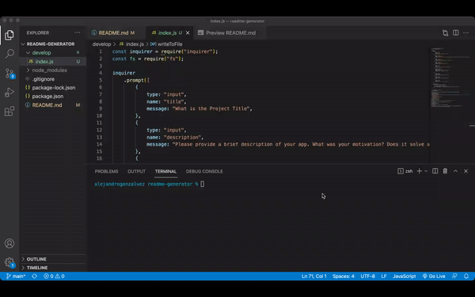

# ReadMe Generator

  
## Description
This app uses Inquirer, and allows users to create easy, professional ReadMes in a heartbeat!
## Table of Contents 
- [Installation](#installation)
- [Usage](#usage)
- [License](#license)
- [Contributors](#contributors)
- [Testing](#test)
- [Questions](#questions)
## Installation
1. Copy package.json from repo 
2. Run "npm i" to install all necessary packages
## Usage
* 
* [Click](https://drive.google.com/file/d/1j_YmL2GmwZ6uWOBymOR739R7LRCF8weu/view) this link watch video walkthrough for this app. 
## License
This application is under the MIT license.  
## Contributors
N/A.
## Testing
This application was tested using N/A
## Questions
For more information, please visit [GitHub Profile](https://github.com/agonzalvez/).  
For any questions, you may email me at agonzalvez1@gmail.com.